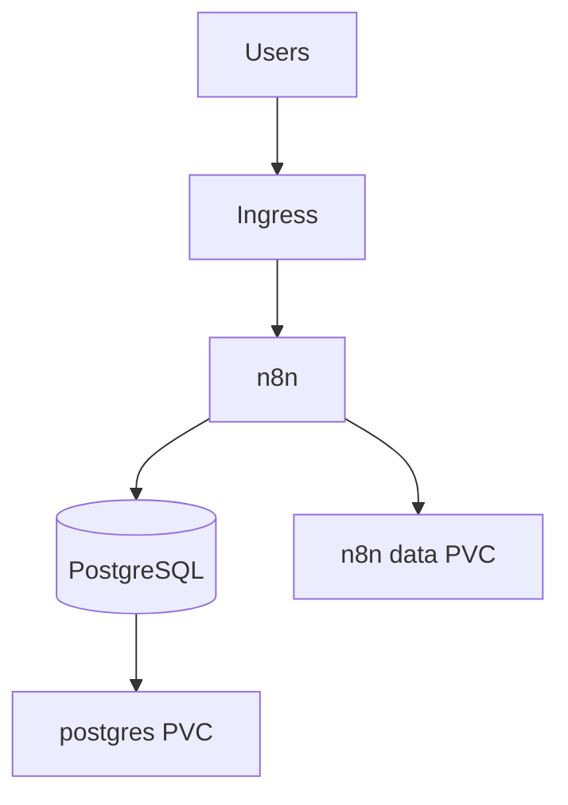

# n8n on Kubernetes

**Author:** José Martinez | Arkhadia by GHC

Self-hosted **n8n** with **PostgreSQL** on Kubernetes, exposed at `https://n8n-dev.arkhadia.com` via Ingress NGINX.

---

## Architecture

Full diagrams: **[docs/architecture.md](docs/architecture.md)**



---

## Prerequisites

- Kubernetes cluster with default **StorageClass**
- **Ingress NGINX** controller (`ingressClassName: nginx`)
- DNS for `n8n-dev.arkhadia.com` → ingress load balancer
- `kubectl` and `kustomize` (built into kubectl 1.21+)

---

## Deploy

### 1. Prepare secrets

```bash
./scripts/prepare-secrets.sh
# Edit kubernetes/secrets/postgres.env and n8n.env
# N8N_ENCRYPTION_KEY: openssl rand -hex 32
```

### 2. Apply manifests

```bash
kubectl apply -k kubernetes/
```

### 3. Verify

```bash
kubectl -n n8n get pods,svc,ingress
kubectl -n n8n wait --for=condition=ready pod -l app=n8n --timeout=300s
curl -I https://n8n-dev.arkhadia.com/healthz
```

Open `https://n8n-dev.arkhadia.com` and sign in with basic auth credentials from `n8n.env`.

---

## Repository layout

```
n8n/
├── docs/architecture.md
├── kubernetes/
│   ├── kustomization.yaml
│   ├── n8n-configmap.yaml
│   ├── n8n-deployment.yaml
│   ├── postgres-deployment.yaml
│   ├── n8n-ingress.yaml
│   └── secrets/*.env.example
└── scripts/prepare-secrets.sh
```

---

## Configuration

| Item | Location |
|------|----------|
| Public URL / webhooks | `kubernetes/n8n-configmap.yaml` |
| DB credentials | `kubernetes/secrets/postgres.env` |
| Encryption + basic auth | `kubernetes/secrets/n8n.env` |
| Image version | `n8n-deployment.yaml` (`n8nio/n8n:1.108.2`) |

---

## Security notes

- Never commit `postgres.env` or `n8n.env` (gitignored).
- **`N8N_ENCRYPTION_KEY`** is required; loss = unreadable credentials in DB.
- Basic auth is enabled via `n8n-secret`; use strong passwords.
- Ingress uses `force-ssl-redirect: true` — terminate TLS at ingress with a valid cert.

---

## Troubleshooting

| Symptom | Check |
|---------|--------|
| Pod `CrashLoopBackOff` | `kubectl -n n8n logs deploy/n8n` |
| DB connection errors | `kubectl -n n8n logs deploy/postgres` |
| 503 on readiness | Wait for migrations; `kubectl -n n8n describe pod -l app=n8n` |
| `secret not found` | Run `prepare-secrets.sh` and re-apply |

Dry-run before apply:

```bash
kubectl apply -k kubernetes/ --dry-run=client
```

---

## Contact

- jmartinez@arkhadia.net
- [@genialcorpholding](https://github.com/genialcorpholding)
