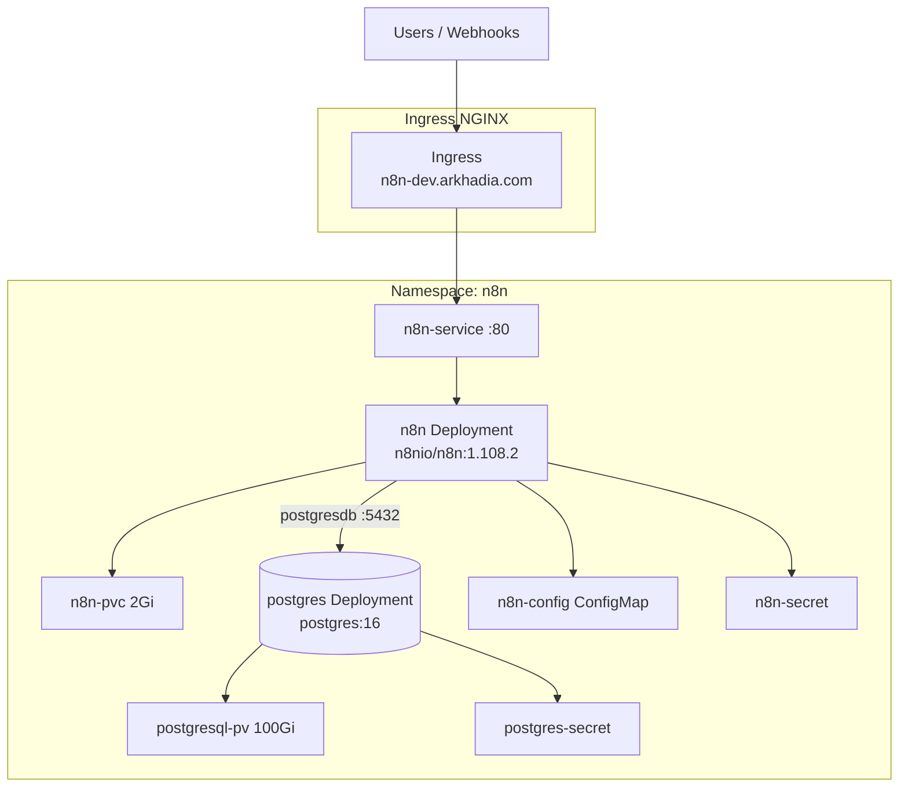
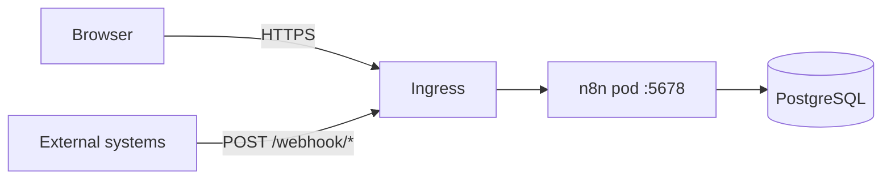
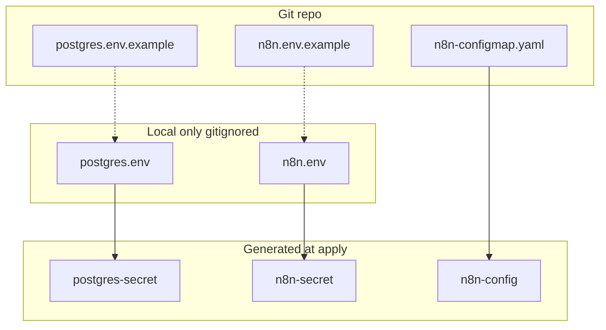
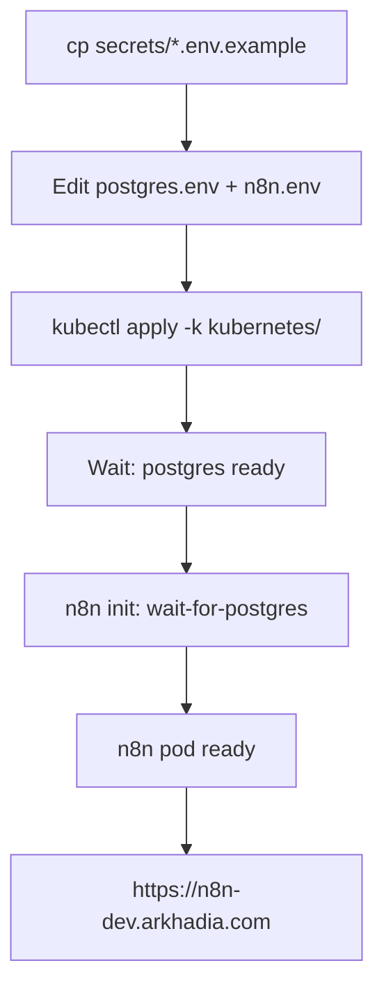

# Architecture diagrams

Visual reference for **n8n** on Kubernetes (`n8n-dev.arkhadia.com`).

---

## Cluster layout

---

## Traffic paths

| Path | Purpose |
|------|---------|
| `/` | Editor UI |
| `/webhook/` | Workflow webhooks |
| `/form/` | n8n forms |
| `/healthz` | Liveness |
| `/healthz/readiness` | Readiness (DB migrated + ready) |

---

## Secrets and configuration

| Secret / Config | Keys |
|-----------------|------|
| `postgres-secret` | `POSTGRES_USER`, `POSTGRES_PASSWORD`, `POSTGRES_DB` |
| `n8n-secret` | `N8N_ENCRYPTION_KEY`, `N8N_BASIC_AUTH_*` |
| `n8n-config` | Host, URLs, DB host, feature flags |

---

## Deployment flow

---

## Related

- [README.md](../README.md) — deploy steps
- [kubernetes/secrets/README.md](../kubernetes/secrets/README.md) — credential files
